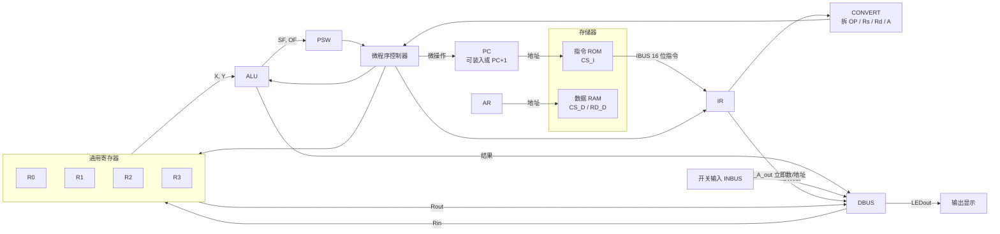
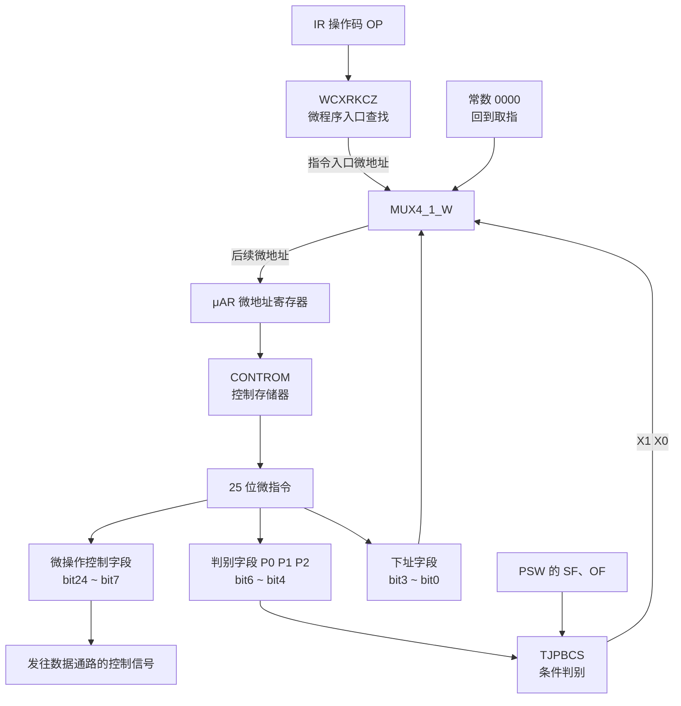
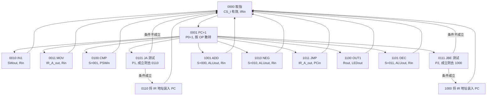
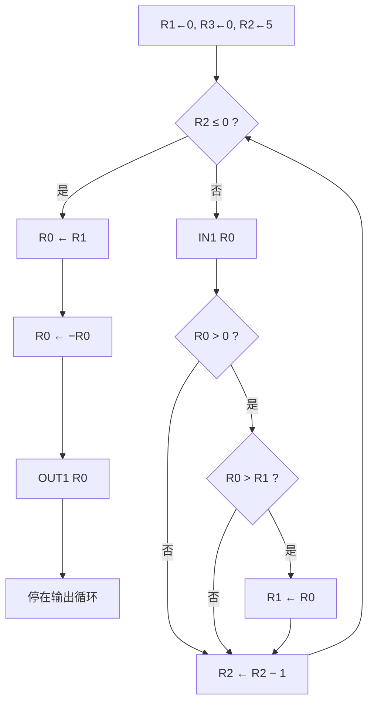

# 桂林电子科技大学计算机组成原理课程设计
#嵌入式 CISC 模型计算机

基于 VHDL 的微程序控制模型机：任意输入 5 个整数，输出其中最大正整数的相反数。

---

## 1. 题目与要求

设计一台嵌入式 CISC 模型计算机。

- CPU 采用三数据总线结构
- 采用现代时序控制，不设单独的时序发生器
- 控制器采用微程序控制器
- 用机器程序验证功能

程序功能（B 类）：

> 任意输入 5 个整数，输出其中最大正整数的相反数。必须设计一条求相反数指令。

设计范围包括：

1. 模型机数据通路
2. 微程序控制器
3. 指令格式与指令系统
4. 各指令的指令周期
5. 全部单元电路，并用 VHDL 组成顶层
6. 汇编程序，以及手工转换后的机器码
7. 机器码写入指令 ROM
8. 用 EDA 软件做功能仿真，并用波形核对输入、输出和中间信号

数据用 8 位定点整数补码。测试数据为 `5, -27, 7, 9, 3`，期望输出为最大正整数 `9` 的相反数，补码 `F7`。

---

## 2. 总体结构

指令和数据分开存放。指令经指令总线 IBUS 传送，数据经数据总线 DBUS 传送，地址也分成指令侧和数据侧。



要点：

- 取指时 PC 送地址，ROM 在 `CS_I = 0` 时把 16 位指令送到 IR。
- IR 拆成操作码、源寄存器 Rs、目的寄存器 Rd、8 位地址或立即数。操作码送给微程序入口逻辑。
- 寄存器堆有 R0～R3。写入用统一的 `Rin`，再由 Rs/Rd 字段选择是哪一个寄存器。
- ALU 的两路输入来自寄存器堆，结果可经 `ALUout` 回到总线，并产生标志送给 PSW。
- 本题目的程序只用寄存器、立即数和开关输入，微程序里没有真正的数据 RAM 读写。数据 RAM 的片选在微指令中保持未选中。
- 输入来自开关 `SWout`，输出送到 LED `LEDout`。
- 所有寄存器在对应写入脉冲有效时锁存。控制器不另设节拍发生器，一条微指令就是一个控制步。

---

## 3. 微程序控制器

控制器以控制存储器 CONTROM 为核心。微地址寄存器 μAR 在时钟作用下给出当前微地址，读出一条微指令。微指令分成下址字段、判别字段和微操作控制字段。



三条转移路径：

| 情况 | 后续微地址 |
| --- | --- |
| 顺序执行 | 本条微指令的下址字段 |
| 取指之后按操作码散转 | WCXRKCZ 查出的入口微地址 |
| 条件不成立，或需要直接回到取指 | 常数 `0000` |

μAR 在时钟下降沿装入新微地址，`CLR = 0` 时清零，因此复位后从微地址 `0000` 开始取指。

---

## 4. 指令系统

### 4.1 指令格式

指令字长 16 位。

```text
15      12 11  10 9   8 7              0
+---------+------+-----+----------------+
|   OP    |  Rs  |  Rd |   addr / im    |
+---------+------+-----+----------------+
  4 bit     2 bit  2 bit     8 bit
```

| 字段 | 位 | 含义 |
| --- | --- | --- |
| OP | 15～12 | 操作码 |
| Rs | 11～10 | 源寄存器。不使用时填任意值 |
| Rd | 9～8 | 目的寄存器。不使用时填任意值 |
| addr / im | 7～0 | 跳转地址或 8 位立即数。不使用时填 0 |

寄存器编码：

| 编码 | 寄存器 |
| --- | --- |
| 00 | R0 |
| 01 | R1 |
| 10 | R2 |
| 11 | R3 |

### 4.2 数据格式

单字长 8 位，定点整数补码。最高位是符号位。

| 位 | 7 | 6～0 |
| --- | --- | --- |
| 含义 | 符号位 | 尾数 |

负数用补码。例如 `-27 = E5`，`-9 = F7`。

### 4.3 指令功能

| 助记符 | OP | Rs | Rd | 7～0 | 功能 |
| --- | --- | --- | --- | --- | --- |
| `IN1 Rd` | 0001 | ×× | Rd | ×× | 开关输入一个整数，写入 Rd |
| `MOV Rd, im` | 0010 | ×× | Rd | im | `Rd ← im` |
| `CMP Rs, Rd` | 0011 | Rs | Rd | ×× | 比较 Rs 与 Rd，按 Rs − Rd 设置标志，不回写寄存器 |
| `JA addr` | 0100 | ×× | ×× | addr | 大于（实现上含等于）则 `PC ← addr` |
| `JBE addr` | 0101 | ×× | ×× | addr | 小于则 `PC ← addr`。与 JA 互补 |
| `ADD Rs, Rd` | 0110 | Rs | Rd | ×× | `Rd ← Rs + Rd` |
| `NEG Rd` | 0111 | ×× | Rd | ×× | `Rd ← −Rd` |
| `JMP addr` | 1000 | ×× | ×× | addr | `PC ← addr` |
| `OUT1 Rs` | 1001 | Rs | ×× | ×× | 输出 Rs |
| `DEC Rd` | 1010 | ×× | Rd | ×× | `Rd ← Rd − 1` |

两条为完成本题专门使用的指令：

- `NEG Rd` 完成题目要求的求相反数，ALU 选择 `0 − Y`。
- `DEC Rd` 做循环计数，ALU 选择 `Y − 1`。

指令系统里没有 `MOV Rd, Rs`。寄存器之间的传送用两步完成：

```text
MOV Rd, 0
ADD Rs, Rd      ; Rd ← Rs + Rd = Rs + 0
```

条件跳转的真实含义要以标志为准，见第 6 节。报告里的名称是 JA、JBE，但实现没有单独的零标志，相等时会走 JA 一侧。

---

## 5. 指令周期

公共周期只有两步，然后按操作码进入对应微程序，执行完回到取指。



报告叙述里曾把 IN1 写成 S3、MOV 写成 S4，和同页表格差一拍。入口地址以控制存储器和 `WCXRKCZ` 为准：

| 指令 | 操作码 | 入口微地址 | 执行时的有效信号 |
| --- | --- | --- | --- |
| 取指 | — | 0000 | `IRin`，指令 ROM 片选有效，下址 0001 |
| PC+1 并散转 | — | 0001 | `PC_1`、`PCin`，`P0 = 1` |
| IN1 | 0001 | 0010 | `SWout`、`Rin` |
| MOV | 0010 | 0011 | `IR_A_out`、`Rin` |
| CMP | 0011 | 0100 | `S0 = 1`（做减法），`PSWin` |
| JA | 0100 | 0101 | `P1 = 1`，下址 0110 |
| JA 成功 | — | 0110 | `IR_A_out`、`PCin`，且 `PC_1 = 0`，装入地址 |
| JBE | 0101 | 0111 | `P2 = 1`，下址 1000 |
| JBE 成功 | — | 1000 | `IR_A_out`、`PCin` |
| ADD | 0110 | 1001 | `ALUout`、`Rin`、`PSWin`，ALU 选择加 |
| NEG | 0111 | 1010 | `ALUout`、`Rin`、`PSWin`，ALU 选择 `0−Y` |
| JMP | 1000 | 1011 | `IR_A_out`、`PCin` |
| OUT1 | 1001 | 1100 | `Rout`、`LEDout` |
| DEC | 1010 | 1101 | `ALUout`、`Rin`、`PSWin`，ALU 选择 `Y−1` |

JA 和 JBE 都是两拍：第一拍只做条件判断，第二拍才把 IR 的地址字段装入 PC。其余指令一拍执行完，下址直接回到 `0000`。

---

## 6. 微指令格式

微指令 25 位，与 `CONTROM` 的 `DATAOUT(24 DOWNTO 0)` 一致。

```text
24    23   22   21   20   19    18   17 16 15    14      13     12
PC_1  PCin ARin IRin Rin  PSWin Rout S2 S1 S0   ALUout  SWout  LEDout

11    10    9       8     7         6  5  4   3     0
RD_D  CS_D  RAMout  CS_I  IR_A_out  P0 P1 P2  下址字段
```

| 位 | 信号 | 为 1 时的作用 |
| --- | --- | --- |
| 24 | PC_1 | 与 PCin 同时为 1 时，PC 加 1；为 0 且 PCin 为 1 时装入总线数据 |
| 23 | PCin | 允许修改 PC |
| 22 | ARin | 地址寄存器装入 |
| 21 | IRin | 指令寄存器装入 |
| 20 | Rin | 把总线数据写入 Rd 指定的通用寄存器 |
| 19 | PSWin | 把 ALU 标志锁存进 PSW |
| 18 | Rout | 通用寄存器送往总线 |
| 17～15 | S2 S1 S0 | ALU 功能选择 |
| 14 | ALUout | ALU 结果送往总线 |
| 13 | SWout | 开关输入送往总线 |
| 12 | LEDout | 总线数据送输出显示 |
| 11 | RD_D | 数据存储器读。配合 CS_D，0 为写、1 为读 |
| 10 | CS_D | 数据存储器片选，低电平有效 |
| 9 | RAMout | 数据存储器送往总线 |
| 8 | CS_I | 指令 ROM 片选，低电平有效 |
| 7 | IR_A_out | IR 的低 8 位（立即数或地址）送往总线 |
| 6～4 | P0 P1 P2 | 判别字段，决定下一条微地址从哪里来 |
| 3～0 | 下址 | 顺序执行时的后续微地址 |

片选是低电平有效。取指微指令里 `CS_I = 0`、`CS_D = 1`，表示选中指令 ROM、不选数据 RAM。下面的「有效信号」只列真正驱动数据通路的信号，不再把这种常态片选重复写出。

### 6.1 PC

实现见 `PC.vhd`，在时钟上升沿动作。

| CLR | PC_1 | PCin | 时钟 | 功能 |
| --- | --- | --- | --- | --- |
| 0 | × | × | × | PC 清零 |
| 1 | 0 | 1 | 上升沿 | `PC ← 总线` |
| 1 | × | 0 | 上升沿 | 保持 |
| 1 | 1 | 1 | 上升沿 | `PC ← PC + 1` |

报告功能表把「保持」写成 `PC+1 = 1` 且 `PCin = 0`。代码更直接：只要 `PCin = 0` 就保持。

IR 在时钟下降沿、且写入允许时锁存。μAR 也在下降沿装入。PC 用上升沿。仿真时要按这个相位看波形，不能把所有寄存器都当成同一沿。

### 6.2 ALU

`S2 S1 S0` 的功能以 `ALU.vhd` 为准。报告功能表写的是 CF、ZF，代码实际产生并锁存的是 SF 和 OF。

| S2 S1 S0 | 运算 | 标志 |
| --- | --- | --- |
| 000 | `X + Y` | 修改 SF、OF |
| 001 | `X − Y` | 修改 SF、OF |
| 010 | `0 − Y` | 修改 SF、OF。NEG 使用 |
| 011 | `Y − 1` | 修改 SF、OF。DEC 使用 |
| 100 | `X AND Y` | SF 为结果符号，OF 清零 |
| 101 | `X OR Y` | SF 为结果符号，OF 清零 |
| 110 | `Y` | 传送 Y，OF 清零 |
| 111 | 0 | SF、OF 清零 |

约定 X 来自 Rs，Y 来自 Rd，需要回写时写入 Rd。因此：

- `ADD Rs, Rd` 得到 `Rd ← Rs + Rd`
- `CMP Rs, Rd` 计算 `Rs − Rd`，只写 PSW
- `NEG Rd` 计算 `0 − Rd`
- `DEC Rd` 计算 `Rd − 1`

溢出的判断与代码一致：

- 加法：同号相加变成异号
- 减法：`X − Y` 时，X、Y 符号不同且结果符号与 X 不同
- `0 − Y`：Y 为负且结果仍为负
- `Y − 1`：Y 为正且结果为负

SF 取结果的第 7 位。PSW 只在 `PSWin = 1` 且时钟上升沿时更新。

### 6.3 数据 RAM

本题程序没有使用，功能仍按报告保留。

| CS_D | RD_D | 时钟 | 功能 |
| --- | --- | --- | --- |
| 1 | × | 上升沿 | 不选择 |
| 0 | 0 | 上升沿 | 写 |
| 0 | 1 | 上升沿 | 读 |

---

## 7. 微地址转移

判别逻辑由 `TJPBCS.vhd` 实现：

```text
X1 = P1 OR P2
X0 = P0
     OR (P1 AND (SF XOR OF))
     OR (P2 AND NOT (SF XOR OF))
```

`MUX4_1_W` 只有两路数据输入，另外一路是常数 0：

| X1 | X0 | 输出 | 在本设计中的来源 |
| --- | --- | --- | --- |
| 0 | 0 | WO | 微指令下址字段 |
| 0 | 1 | WI | WCXRKCZ 产生的入口微地址 |
| 1 | 0 | WO | 仍是下址字段。JA/JBE 成功时走这里 |
| 1 | 1 | `0000` | 条件不成立，回到取指 |

因此图上的「四选一」在代码里是：下址、入口、再一次下址、常数 0。JA/JBE 的分支目标不是另做一套地址，而是写在测试微指令自己的下址字段里。JA 的下址是 `0110`，JBE 的下址是 `1000`。

按操作码得到的入口：

| 指令 | 操作码 | 入口 |
| --- | --- | --- |
| IN1 Rd | 0001 | 0010 |
| MOV Rd, im | 0010 | 0011 |
| CMP Rs, Rd | 0011 | 0100 |
| JA addr | 0100 | 0101 |
| JBE addr | 0101 | 0111 |
| ADD Rs, Rd | 0110 | 1001 |
| NEG Rd | 0111 | 1010 |
| JMP addr | 1000 | 1011 |
| OUT1 Rs | 1001 | 1100 |
| DEC Rd | 1010 | 1101 |
| 其他 | — | 0000 |

条件本身只有 `SF XOR OF`，没有 ZF。

| 指令 | 跳转条件 | 不跳转时 |
| --- | --- | --- |
| JA | `SF XOR OF = 0` | 下一条微地址为 0000 |
| JBE | `SF XOR OF = 1` | 下一条微地址为 0000 |

两者覆盖全部情况，必然走其中一条。减法结果为 0 时 SF 和 OF 都是 0，异或为 0，所以会走 JA，不会走 JBE。也就是说：

- 名为 JA 的指令，实际是「大于或等于」才跳
- 名为 JBE 的指令，实际是「小于」才跳，等于时不跳

找最大值时这仍然可用。等于当前最大值就再写一次相同的数；0 与初值 0 比较也不会把最大值改坏。若以后要把「大于」和「等于」严格分开，需要增加零标志。

报告中的 4 选 1 表有两行 P2 的 X0 与上面的逻辑式相反。实现以逻辑式和 `TJPBCS.vhd` 为准，不要按那两行表去改代码。

---

## 8. 微指令代码

下列代码与 `CONTROM.vhd` 中的 25 位常数一致，从 bit24 写到 bit0。

| 微地址 | 微指令 | 含义 | 判别 | 下址 |
| --- | --- | --- | --- | --- |
| 0000 | `0001000000000010000000001` | 取指，IRin | 000 | 0001 |
| 0001 | `1100000000000010101000000` | PC+1，P0 散转 | 100 | 0000 |
| 0010 | `0000100000010010100000000` | IN1 | 000 | 0000 |
| 0011 | `0000100000000010110000000` | MOV | 000 | 0000 |
| 0100 | `0000010001000010100000000` | CMP，减法 | 000 | 0000 |
| 0101 | `0000000000000010100100110` | JA 测试 | 010 | 0110 |
| 0110 | `0100000000000010110000000` | 地址装入 PC | 000 | 0000 |
| 0111 | `0000000000000010100011000` | JBE 测试 | 001 | 1000 |
| 1000 | `0100000000000010110000000` | 地址装入 PC | 000 | 0000 |
| 1001 | `0000110000100010100000000` | ADD | 000 | 0000 |
| 1010 | `0000110010100010100000000` | NEG | 000 | 0000 |
| 1011 | `0100000000000010110000000` | JMP | 000 | 0000 |
| 1100 | `0000001000001010100000000` | OUT1 | 000 | 0000 |
| 1101 | `0000110011100010100000000` | DEC | 000 | 0000 |

未使用的微地址在代码里给到 `0000000000000101000000000`。

---

## 9. 应用程序

目标：输入 5 个 8 位补码整数，找出最大的正整数，输出它的相反数。没有正数时，最大值保持 0，输出也是 0。

### 9.1 寄存器约定

| 寄存器 | 用途 |
| --- | --- |
| R1 | 当前最大正整数，初值 0 |
| R3 | 常数 0，用来和输入、计数器比较 |
| R2 | 剩余输入次数 |
| R0 | 本次输入，最后也用来存放待输出的结果 |

### 9.2 算法



比较要用 `JBE` 做「不大于就跳过」。更新最大值时没有寄存器传送指令，所以先把 R1 清零，再用 `ADD R0, R1` 完成 `R1 ← R0`。输出前同样用 `MOV R0, 0` 和 `ADD R1, R0` 把 R1 复制到 R0，然后 `NEG R0`、`OUT1 R0`。

循环次数要和 `DEC` 的位置一起算。先判断、后减 1 时，R2 的初值就是输入个数。初值为 5 时，依次以 5、4、3、2、1 进入循环，减到 0 后退出，共输入 5 次。

### 9.3 建议对照的机器程序

这是按上述算法和本指令系统整理的一份完整程序，便于仿真对照。它不是把报告两处原文强行说成同一份。

| 地址 | 汇编 | 二进制 | 十六进制 | 说明 |
| --- | --- | --- | --- | --- |
| 00 | `MOV R1, 0` | 0010000100000000 | 2100 | 最大值清零 |
| 01 | `MOV R3, 0` | 0010001100000000 | 2300 | 常数 0 |
| 02 | `MOV R2, 5` | 0010001000000101 | 2205 | 输入 5 次 |
| 03 | `CMP R2, R3` | 0011101100000000 | 3B00 | R2 − 0 |
| 04 | `JBE 0E` | 0101000000001110 | 500E | R2 小于 0 才退出；等于 0 时按实现不会走 JBE |
| 05 | `IN1 R0` | 0001000000000000 | 1000 | 输入 |
| 06 | `CMP R0, R3` | 0011001100000000 | 3300 | 输入 − 0 |
| 07 | `JBE 0C` | 0101000000001100 | 500C | 负数则跳过更新 |
| 08 | `CMP R0, R1` | 0011000100000000 | 3100 | 输入 − 当前最大值 |
| 09 | `JBE 0C` | 0101000000001100 | 500C | 不大于最大值则跳过 |
| 0A | `MOV R1, 0` | 0010000100000000 | 2100 | 为复制做准备 |
| 0B | `ADD R0, R1` | 0110000100000000 | 6100 | R1 ← R0 |
| 0C | `DEC R2` | 1010001000000000 | A200 | 次数减 1 |
| 0D | `JMP 03` | 1000000000000011 | 8003 | 回到判断 |
| 0E | `MOV R0, 0` | 0010000000000000 | 2000 | |
| 0F | `ADD R1, R0` | 0110010000000000 | 6400 | R0 ← R1 |
| 10 | `NEG R0` | 0111000000000000 | 7000 | 求相反数 |
| 11 | `OUT1 R0` | 1001000000000000 | 9000 | 输出 |
| 12 | `JMP 0E` | 1000000000001110 | 800E | 停住 |

这里有一个和标志定义有关的边界：`JBE` 在结果等于 0 时不跳。R2 从 1 减到 0 后，下一次 `CMP R2, R3` 的结果是 0，JA 类条件成立、JBE 不成立，因此不会在 0 处退出，还会再输入一次。若仿真发现多读了一个数，把初值改成 4，或在比较前先减，两种改法都可以，但要和波形上的 `IN1` 次数一起核对。报告附录里的 ROM 使用初值 4，就是这种差一的写法。

### 9.4 报告正文中的程序表

报告表 4.10 如下。它把循环次数写成 5，但循环体没有 `DEC`，`0E` 又是 `JMP 03`，按表直接执行时 R2 不会减少。

| 地址 | 汇编 | 二进制 | 十六进制 |
| --- | --- | --- | --- |
| 00 | `MOV R1, 0` | 0010000100000000 | 2100 |
| 01 | `MOV R3, 0` | 0010001100000000 | 2300 |
| 02 | `MOV R2, 5` | 0010001000000101 | 2205 |
| 03 | `MOV R0, FF` | 0010000011111111 | 20FF |
| 04 | `ADD R0, R2` | 0110001000000000 | 6200 |
| 05 | `CMP R2, R3` | 0011101100000000 | 3B00 |
| 06 | `JBE 10` | 0101000000010000 | 5010 |
| 07 | `IN1 R0` | 0001000000000000 | 1000 |
| 08 | `CMP R0, R3` | 0011001100000000 | 3300 |
| 09 | `JBE 0E` | 0101000000001110 | 500E |
| 0A | `CMP R0, R1` | 0011000100000000 | 3100 |
| 0B | `JBE 0E` | 0101000000001110 | 500E |
| 0C | `MOV R1, 0` | 0010000100000000 | 2100 |
| 0D | `ADD R0, R1` | 0110000100000000 | 6100 |
| 0E | `JMP 03` | 1000000000000011 | 8003 |
| 0F | `NOP` | 0000000000000000 | 0000 |
| 10 | `MOV R0, 0` | 0010000000000000 | 2000 |
| 11 | `ADD R1, R0` | 0110010000000000 | 6400 |
| 12 | `NEG R0` | 0111000000000000 | 7000 |
| 13 | `OUT1 R0` | 1001000000000000 | 9000 |
| 14 | `JMP 10` | 1000000000010000 | 8010 |

### 9.5 附录 ROM 中实际固化的程序

`ROM.vhd` 里的程序使用了 `DEC`，结构与 9.3 相同，但 `MOV R2` 的立即数是 4，不是 5。地址也整体前移，结束地址是 `0E` 而不是 `10`。

| 地址 | 汇编 | 机器码 | 十六进制 |
| --- | --- | --- | --- |
| 00 | `MOV R1, 0` | 0010000100000000 | 2100 |
| 01 | `MOV R3, 0` | 0010001100000000 | 2300 |
| 02 | `MOV R2, 4` | 0010001000000100 | 2204 |
| 03 | `CMP R2, R3` | 0011101100000000 | 3B00 |
| 04 | `JBE 0E` | 0101000000001110 | 500E |
| 05 | `IN1 R0` | 0001000000000000 | 1000 |
| 06 | `CMP R0, R3` | 0011001100000000 | 3300 |
| 07 | `JBE 0C` | 0101000000001100 | 500C |
| 08 | `CMP R0, R1` | 0011000100000000 | 3100 |
| 09 | `JBE 0C` | 0101000000001100 | 500C |
| 0A | `MOV R1, 0` | 0010000100000000 | 2100 |
| 0B | `ADD R0, R1` | 0110000100000000 | 6100 |
| 0C | `DEC R2` | 1010001000000000 | A200 |
| 0D | `JMP 03` | 1000000000000011 | 8003 |
| 0E | `MOV R0, 0` | 0010000000000000 | 2000 |
| 0F | `ADD R1, R0` | 0110010000000000 | 6400 |
| 10 | `NEG R0` | 0111000000000000 | 7000 |
| 11 | `OUT1 R0` | 1001000000000000 | 9000 |
| 12 | `JMP 0E` | 1000000000001110 | 800E |

对照仿真时，以波形里 `IN1`（机器码 `1000`）实际出现的次数为准，确认送进 INBUS 的是 5 个数还是 4 个数。

---

## 10. 功能仿真

测试数据：

| 十进制 | 8 位补码 |
| --- | --- |
| 5 | 05 |
| −27 | E5 |
| 7 | 07 |
| 9 | 09 |
| 3 | 03 |

处理过程：

1. 5 是正数，且大于初值 0，最大值变为 05。
2. −27 不是正数，跳过。
3. 7 大于 5，最大值变为 07。
4. 9 大于 7，最大值变为 09。
5. 3 小于 9，不更新。
6. 对 09 执行 `NEG`，得到 `F7`（二进制 `11110111`，即 −9）。
7. `OUT1` 输出 `F7`。

数据要在 `IN1` 的执行微周期送到 INBUS，不能只按指令地址 05 或机器码 `1000` 在 ROM 里的位置去卡拍。正数会进入「比较最大值并可能回写」的路径，负数在第一次 `JBE` 就离开，两条路径的时钟数不同。

观察波形时建议保留：`CLK`、`CLR`、PC、IR、μAR、微指令或主要控制信号、R0～R3、PSW 的 SF/OF、INBUS、输出端口。输出稳定在 `F7` 后，结果即与题目要求一致。

---

## 11. 调试记录

一次把 5 个数按固定间隔全部加到输入上时，取数指令 `1000` 在波形上的位置会相对输入发生偏移，最大值计算错误。

原因不是补码算错，而是正数和负数的执行路径长度不同。负数更早跳过后续比较，占用的节拍更少。输入如果按「每次间隔相同」预先排好，就会和真正的 `IN1` 周期错开，等于把数据送给了别的指令。

可行的查法：

1. 先只送第一个数，在波形里找到 `IR = 1000` 且 `SWout`、`Rin` 有效的时刻。
2. 记下该时刻与上一次取数之间隔了多少个时钟。
3. 再送下一个数，不要假定正数和负数的间隔相同。
4. 每送完一个数，看 R1 是否按「只保留更大的正数」变化。
5. 五次之后看 `NEG` 之前 R0 是否为 `09`，`OUT1` 是否为 `F7`。

这个现象说明功能仿真不能只检查程序的文字逻辑，还要按微指令逐拍核对总线和标志。

---

## 12. 顶层与模块

顶层把数据通路和控制器接在一起。控制器内部是入口查找、控制存储器、判别逻辑、微地址选择和 μAR。

| 文件 | 作用 |
| --- | --- |
| `WCXRKCZ.vhd` | 操作码到微程序入口 |
| `TJPBCS.vhd` | 由 P0、P1、P2 和 SF、OF 产生 MUX 的 X1、X0 |
| `MUX4_1_W.vhd` | 选择下一条微地址 |
| `UAR.vhd` | 微地址寄存器，下降沿装入，低电平清零 |
| `CONTROM.vhd` | 25 位微指令 |
| `ALU.vhd` | 算术逻辑运算及 SF、OF |
| `PC.vhd` | 程序计数器 |
| `ROM.vhd` | 机器程序 |
| `IR.vhd` | 指令寄存器，下降沿装入 |
| `PSW.vhd` | 锁存 SF、OF |
| `CONVERT.vhd` | 拆分 16 位指令 |

顶层原理图中还有寄存器堆、总线开关和输入输出端口，报告里用图形文件连接，没有再写成单独的 VHDL 清单。

阅读代码时建议知道这几处原稿限制：

- `ALU` 和 `WCXRKCZ` 的 `PROCESS` 没有敏感信号表，综合与仿真是否反复计算，取决于工具。
- 原稿把 `ENTITY ALU` 排成了 `ENTITYALU`，整理进工程时要补上空格。
- `CONTROM` 开头的库声明在原稿里写了两遍。
- `MUX4_1_W` 并不是四个独立数据输入。
- 报告 ALU 表使用 CF、ZF 这两个名字，PSW 端口使用 SF、OF。
- 表 4.10 与 `ROM.vhd` 不是同一份机器码。

---

## 13. 设计要点

- 微程序把「取指、改 PC、按操作码散转、执行、再取指」拆成可以逐条检查的微指令，数据通路上不再需要单独的节拍发生器。
- 下址字段负责顺序，P0 负责指令入口，P1/P2 负责条件。分支目标写在测试微指令的下址里，不成立则回到 `0000`。
- 指令格式固定为 4 位操作码、两个 2 位寄存器号和 8 位立即数或地址。手编机器码时按这个字段拼接即可。
- 没有寄存器传送指令时，清零再相加就是传送。本题的最大值保存和最后取出都用这个方法。
- `NEG` 不必单独做一套求补电路，ALU 的 `0 − Y` 就是求相反数。
- 条件分支如果只有符号和溢出、没有零标志，等于和大于会落在同一侧。写比较程序之前要先确定这一点。
- 输入指令的数据必须对准那一拍微操作。路径长度随数据变化时，不能用等间隔的输入波形。

---

## 附录 参考 VHDL

下面按报告软件清单整理，只做了空格和换行上的排版，不改变电路含义。`ROM` 保持附录中的原程序（`MOV R2, 4`）。

### WCXRKCZ.vhd

```vhdl
LIBRARY IEEE;
USE IEEE.STD_LOGIC_1164.ALL;

ENTITY WCXRKCZ IS
    PORT(
        ADDR : IN  STD_LOGIC_VECTOR(3 DOWNTO 0);
        DOUT : OUT STD_LOGIC_VECTOR(3 DOWNTO 0)
    );
END WCXRKCZ;

ARCHITECTURE A OF WCXRKCZ IS
BEGIN
    PROCESS
    BEGIN
        CASE ADDR IS
            WHEN "0001" => DOUT <= "0010";
            WHEN "0010" => DOUT <= "0011";
            WHEN "0011" => DOUT <= "0100";
            WHEN "0100" => DOUT <= "0101";
            WHEN "0101" => DOUT <= "0111";
            WHEN "0110" => DOUT <= "1001";
            WHEN "0111" => DOUT <= "1010";
            WHEN "1000" => DOUT <= "1011";
            WHEN "1001" => DOUT <= "1100";
            WHEN "1010" => DOUT <= "1101";
            WHEN OTHERS => DOUT <= "0000";
        END CASE;
    END PROCESS;
END A;
```

### TJPBCS.vhd

```vhdl
LIBRARY IEEE;
USE IEEE.STD_LOGIC_1164.ALL;

ENTITY TJPBCS IS
    PORT(
        P0, P1, P2, SF, OF_1 : IN  STD_LOGIC;
        X1, X0               : OUT STD_LOGIC
    );
END TJPBCS;

ARCHITECTURE A OF TJPBCS IS
BEGIN
    X1 <= P1 OR P2;
    X0 <= P0 OR (P1 AND (SF XOR OF_1)) OR (P2 AND NOT (SF XOR OF_1));
END A;
```

### MUX4_1_W.vhd

```vhdl
LIBRARY IEEE;
USE IEEE.STD_LOGIC_1164.ALL;

ENTITY MUX4_1_W IS
    PORT(
        WO, WI : IN  STD_LOGIC_VECTOR(3 DOWNTO 0);
        X1, X0 : IN  STD_LOGIC;
        W_OUT  : OUT STD_LOGIC_VECTOR(3 DOWNTO 0)
    );
END MUX4_1_W;

ARCHITECTURE A OF MUX4_1_W IS
BEGIN
    PROCESS (X1, X0, WO, WI)
    BEGIN
        IF (X1 = '0' AND X0 = '0') THEN
            W_OUT <= WO;
        ELSIF (X1 = '0' AND X0 = '1') THEN
            W_OUT <= WI;
        ELSIF (X1 = '1' AND X0 = '0') THEN
            W_OUT <= WO;
        ELSE
            W_OUT <= "0000";
        END IF;
    END PROCESS;
END A;
```

### UAR.vhd

```vhdl
LIBRARY IEEE;
USE IEEE.STD_LOGIC_1164.ALL;

ENTITY UAR IS
    PORT(
        D    : IN  STD_LOGIC_VECTOR(3 DOWNTO 0);
        CLR, CLK : IN  STD_LOGIC;
        DOUT : OUT STD_LOGIC_VECTOR(3 DOWNTO 0)
    );
END UAR;

ARCHITECTURE A OF UAR IS
BEGIN
    PROCESS (CLR, CLK)
    BEGIN
        IF (CLR = '0') THEN
            DOUT <= "0000";
        ELSIF (CLK'EVENT AND CLK = '0') THEN
            DOUT <= D;
        END IF;
    END PROCESS;
END A;
```

### CONTROM.vhd

```vhdl
LIBRARY IEEE;
USE IEEE.STD_LOGIC_1164.ALL;
USE IEEE.STD_LOGIC_ARITH.ALL;
USE IEEE.STD_LOGIC_UNSIGNED.ALL;

ENTITY CONTROM IS
    PORT(
        ADDR : IN  STD_LOGIC_VECTOR(3 DOWNTO 0);
        UA   : OUT STD_LOGIC_VECTOR(3 DOWNTO 0);
        PC_1, PCin, ARin, IRin, Rin, PSWin, Rout, S2, S1, S0 : OUT STD_LOGIC;
        ALUout, SWout, LEDout, RD_D, CS_D, RAMout, CS_I, IR_A_out, P0, P1, P2 : OUT STD_LOGIC
    );
END CONTROM;

ARCHITECTURE A OF CONTROM IS
    SIGNAL DATAOUT : STD_LOGIC_VECTOR(24 DOWNTO 0);
BEGIN
    PROCESS (ADDR)
    BEGIN
        CASE ADDR IS
            WHEN "0000" => DATAOUT <= "0001000000000010000000001";
            WHEN "0001" => DATAOUT <= "1100000000000010101000000";
            WHEN "0010" => DATAOUT <= "0000100000010010100000000";
            WHEN "0011" => DATAOUT <= "0000100000000010110000000";
            WHEN "0100" => DATAOUT <= "0000010001000010100000000";
            WHEN "0101" => DATAOUT <= "0000000000000010100100110";
            WHEN "0110" => DATAOUT <= "0100000000000010110000000";
            WHEN "0111" => DATAOUT <= "0000000000000010100011000";
            WHEN "1000" => DATAOUT <= "0100000000000010110000000";
            WHEN "1001" => DATAOUT <= "0000110000100010100000000";
            WHEN "1010" => DATAOUT <= "0000110010100010100000000";
            WHEN "1011" => DATAOUT <= "0100000000000010110000000";
            WHEN "1100" => DATAOUT <= "0000001000001010100000000";
            WHEN "1101" => DATAOUT <= "0000110011100010100000000";
            WHEN OTHERS => DATAOUT <= "0000000000000101000000000";
        END CASE;

        UA       <= DATAOUT(3 DOWNTO 0);
        P2       <= DATAOUT(4);
        P1       <= DATAOUT(5);
        P0       <= DATAOUT(6);
        IR_A_out <= DATAOUT(7);
        CS_I     <= DATAOUT(8);
        RAMout   <= DATAOUT(9);
        CS_D     <= DATAOUT(10);
        RD_D     <= DATAOUT(11);
        LEDout   <= DATAOUT(12);
        SWout    <= DATAOUT(13);
        ALUout   <= DATAOUT(14);
        S0       <= DATAOUT(15);
        S1       <= DATAOUT(16);
        S2       <= DATAOUT(17);
        Rout     <= DATAOUT(18);
        PSWin    <= DATAOUT(19);
        Rin      <= DATAOUT(20);
        IRin     <= DATAOUT(21);
        ARin     <= DATAOUT(22);
        PCin     <= DATAOUT(23);
        PC_1     <= DATAOUT(24);
    END PROCESS;
END A;
```

### ALU.vhd

```vhdl
LIBRARY IEEE;
USE IEEE.STD_LOGIC_1164.ALL;
USE IEEE.STD_LOGIC_ARITH.ALL;
USE IEEE.STD_LOGIC_UNSIGNED.ALL;

ENTITY ALU IS
    PORT(
        X, Y       : IN  STD_LOGIC_VECTOR(7 DOWNTO 0);
        S2, S1, S0 : IN  STD_LOGIC;
        ALUOUT     : OUT STD_LOGIC_VECTOR(7 DOWNTO 0);
        SF, OF_1   : OUT STD_LOGIC
    );
END ALU;

ARCHITECTURE A OF ALU IS
    SIGNAL AA, BB, TEMP : STD_LOGIC_VECTOR(8 DOWNTO 0);
BEGIN
    PROCESS
    BEGIN
        IF (S2 = '0' AND S1 = '0' AND S0 = '0') THEN
            AA     <= '0' & X;
            BB     <= '0' & Y;
            TEMP   <= AA + BB;
            ALUOUT <= TEMP(7 DOWNTO 0);
            SF     <= TEMP(7);
            OF_1   <= (X(7) AND Y(7) AND NOT TEMP(7)) OR
                      (NOT X(7) AND NOT Y(7) AND TEMP(7));
        ELSIF (S2 = '0' AND S1 = '0' AND S0 = '1') THEN
            AA     <= '0' & X;
            BB     <= '0' & Y;
            TEMP   <= AA - BB;
            ALUOUT <= TEMP(7 DOWNTO 0);
            SF     <= TEMP(7);
            OF_1   <= (X(7) AND NOT Y(7) AND NOT TEMP(7)) OR
                      (NOT X(7) AND Y(7) AND TEMP(7));
        ELSIF (S2 = '0' AND S1 = '1' AND S0 = '0') THEN
            TEMP   <= "000000000" - ('0' & Y);
            ALUOUT <= TEMP(7 DOWNTO 0);
            SF     <= TEMP(7);
            OF_1   <= Y(7) AND TEMP(7);
        ELSIF (S2 = '0' AND S1 = '1' AND S0 = '1') THEN
            AA     <= '0' & Y;
            TEMP   <= AA - 1;
            ALUOUT <= TEMP(7 DOWNTO 0);
            SF     <= TEMP(7);
            OF_1   <= (NOT Y(7) AND TEMP(7));
        ELSIF (S2 = '1' AND S1 = '0' AND S0 = '0') THEN
            ALUOUT <= X AND Y;
            SF     <= X(7) AND Y(7);
            OF_1   <= '0';
        ELSIF (S2 = '1' AND S1 = '0' AND S0 = '1') THEN
            ALUOUT <= X OR Y;
            SF     <= X(7) OR Y(7);
            OF_1   <= '0';
        ELSIF (S2 = '1' AND S1 = '1' AND S0 = '0') THEN
            ALUOUT <= Y;
            SF     <= Y(7);
            OF_1   <= '0';
        ELSE
            ALUOUT <= "00000000";
            SF     <= '0';
            OF_1   <= '0';
        END IF;
    END PROCESS;
END A;
```

### PC.vhd

```vhdl
LIBRARY IEEE;
USE IEEE.STD_LOGIC_1164.ALL;
USE IEEE.STD_LOGIC_ARITH.ALL;
USE IEEE.STD_LOGIC_UNSIGNED.ALL;

ENTITY PC IS
    PORT(
        D            : IN  STD_LOGIC_VECTOR(7 DOWNTO 0);
        CLK, PC_1, PCin, CLR : IN  STD_LOGIC;
        Q            : OUT STD_LOGIC_VECTOR(7 DOWNTO 0)
    );
END PC;

ARCHITECTURE A OF PC IS
    SIGNAL QOUT : STD_LOGIC_VECTOR(7 DOWNTO 0);
BEGIN
    PROCESS (CLK, PC_1, PCin, CLR)
    BEGIN
        IF (CLR = '0') THEN
            QOUT <= "00000000";
        ELSIF (CLK'EVENT AND CLK = '1') THEN
            IF (PCin = '1') THEN
                IF (PC_1 = '0') THEN
                    QOUT <= D;
                ELSE
                    QOUT <= QOUT + 1;
                END IF;
            END IF;
        END IF;
    END PROCESS;
    Q <= QOUT;
END A;
```

### ROM.vhd

```vhdl
LIBRARY IEEE;
USE IEEE.STD_LOGIC_1164.ALL;
USE IEEE.STD_LOGIC_ARITH.ALL;
USE IEEE.STD_LOGIC_SIGNED.ALL;

ENTITY ROM IS
    PORT(
        DOUT : OUT STD_LOGIC_VECTOR(15 DOWNTO 0);
        ADDR : IN  STD_LOGIC_VECTOR(7 DOWNTO 0);
        CS_I : IN  STD_LOGIC
    );
END ROM;

ARCHITECTURE A OF ROM IS
BEGIN
    DOUT <=
        "0010000100000000" WHEN ADDR = "00000000" AND CS_I = '0' ELSE  -- MOV R1,0
        "0010001100000000" WHEN ADDR = "00000001" AND CS_I = '0' ELSE  -- MOV R3,0
        "0010001000000100" WHEN ADDR = "00000010" AND CS_I = '0' ELSE  -- MOV R2,4
        "0011101100000000" WHEN ADDR = "00000011" AND CS_I = '0' ELSE  -- CMP R2,R3
        "0101000000001110" WHEN ADDR = "00000100" AND CS_I = '0' ELSE  -- JBE 0E
        "0001000000000000" WHEN ADDR = "00000101" AND CS_I = '0' ELSE  -- IN1 R0
        "0011001100000000" WHEN ADDR = "00000110" AND CS_I = '0' ELSE  -- CMP R0,R3
        "0101000000001100" WHEN ADDR = "00000111" AND CS_I = '0' ELSE  -- JBE 0C
        "0011000100000000" WHEN ADDR = "00001000" AND CS_I = '0' ELSE  -- CMP R0,R1
        "0101000000001100" WHEN ADDR = "00001001" AND CS_I = '0' ELSE  -- JBE 0C
        "0010000100000000" WHEN ADDR = "00001010" AND CS_I = '0' ELSE  -- MOV R1,0
        "0110000100000000" WHEN ADDR = "00001011" AND CS_I = '0' ELSE  -- ADD R0,R1
        "1010001000000000" WHEN ADDR = "00001100" AND CS_I = '0' ELSE  -- DEC R2
        "1000000000000011" WHEN ADDR = "00001101" AND CS_I = '0' ELSE  -- JMP 03
        "0010000000000000" WHEN ADDR = "00001110" AND CS_I = '0' ELSE  -- MOV R0,0
        "0110010000000000" WHEN ADDR = "00001111" AND CS_I = '0' ELSE  -- ADD R1,R0
        "0111000000000000" WHEN ADDR = "00010000" AND CS_I = '0' ELSE  -- NEG R0
        "1001000000000000" WHEN ADDR = "00010001" AND CS_I = '0' ELSE  -- OUT1 R0
        "1000000000001110" WHEN ADDR = "00010010" AND CS_I = '0' ELSE  -- JMP 0E
        "0000000000000000" WHEN CS_I = '0' ELSE
        "0000000000000000";
END A;
```

### IR.vhd

```vhdl
LIBRARY IEEE;
USE IEEE.STD_LOGIC_1164.ALL;

ENTITY IR IS
    PORT(
        D      : IN  STD_LOGIC_VECTOR(15 DOWNTO 0);
        CLK, EN : IN  STD_LOGIC;
        O      : OUT STD_LOGIC_VECTOR(15 DOWNTO 0)
    );
END IR;

ARCHITECTURE A OF IR IS
BEGIN
    PROCESS (CLK, EN)
    BEGIN
        IF (CLK'EVENT AND CLK = '0') THEN
            IF (EN = '1') THEN
                O <= D;
            END IF;
        END IF;
    END PROCESS;
END A;
```

### PSW.vhd

```vhdl
LIBRARY IEEE;
USE IEEE.STD_LOGIC_1164.ALL;

ENTITY PSW IS
    PORT(
        PSWin      : IN  STD_LOGIC;
        SF, OF_1, CLK : IN  STD_LOGIC;
        S, O       : OUT STD_LOGIC
    );
END PSW;

ARCHITECTURE A OF PSW IS
BEGIN
    PROCESS (CLK, PSWin)
    BEGIN
        IF rising_edge(CLK) THEN
            IF PSWin = '1' THEN
                S <= SF;
                O <= OF_1;
            END IF;
        END IF;
    END PROCESS;
END A;
```

### CONVERT.vhd

```vhdl
LIBRARY IEEE;
USE IEEE.STD_LOGIC_1164.ALL;

ENTITY CONVERT IS
    PORT(
        IRCODE       : IN  STD_LOGIC_VECTOR(15 DOWNTO 0);
        OP           : OUT STD_LOGIC_VECTOR(3 DOWNTO 0);
        I11, I10, I9, I8 : OUT STD_LOGIC;
        A            : OUT STD_LOGIC_VECTOR(7 DOWNTO 0)
    );
END CONVERT;

ARCHITECTURE A OF CONVERT IS
BEGIN
    OP  <= IRCODE(15 DOWNTO 12);
    I11 <= IRCODE(11);
    I10 <= IRCODE(10);
    I9  <= IRCODE(9);
    I8  <= IRCODE(8);
    A   <= IRCODE(7 DOWNTO 0);
END A;
```

---

本文仅供计算机组成原理课程学习与设计对照。引用时请保留设计来源说明，谢谢！
